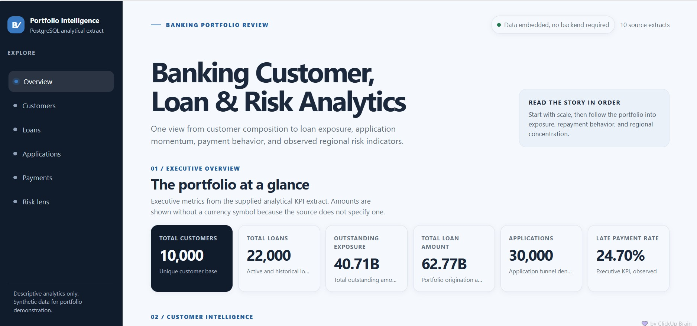
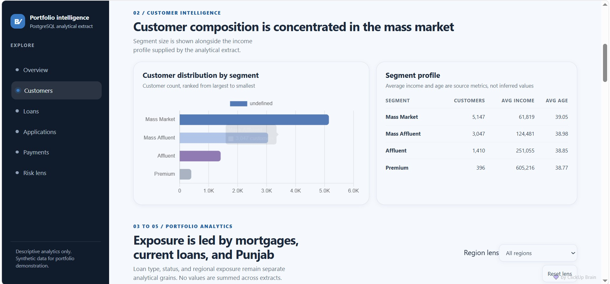
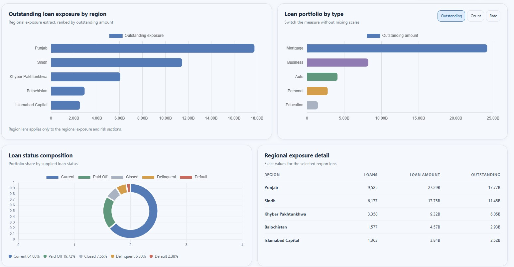
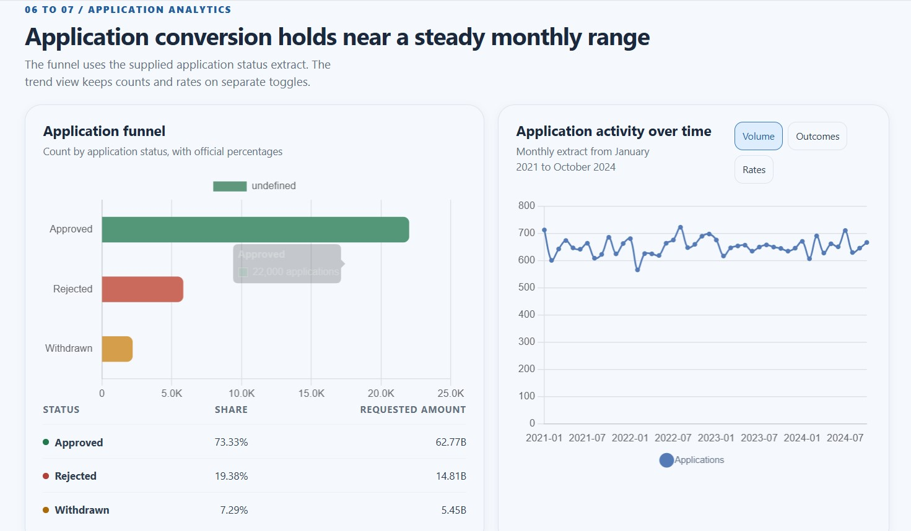
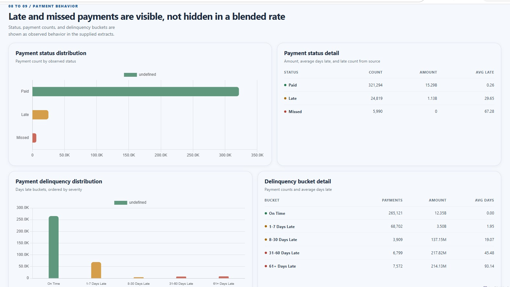
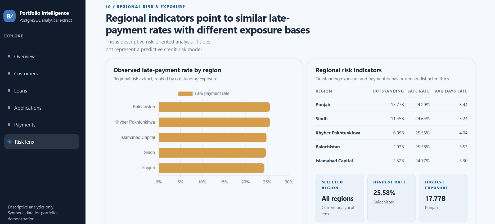

# Banking Customer, Loan & Risk Analytics

[](https://www.postgresql.org/)
[](https://salar13684-lgtm.github.io/banking-customer-loan-risk-analytics/)
[](https://github.com/salar13684-lgtm/banking-customer-loan-risk-analytics)

## 🚀 Live Dashboard

**Interactive Dashboard:** https://salar13684-lgtm.github.io/banking-customer-loan-risk-analytics/

> The repository contains a GitHub Pages deployment workflow that publishes the standalone `dashboard-data/dashboard.html` file as the site entry page. If the Pages workflow has not yet completed successfully, enable **Settings → Pages → Source → GitHub Actions** and rerun the workflow.

---

## 📌 Project Overview

**Banking Customer, Loan & Risk Analytics** is a PostgreSQL-based banking analytics portfolio project focused on customer demographics, banking relationships, loan portfolio exposure, borrowing behavior, loan application performance, payment behavior, delinquency, and descriptive risk-oriented analysis.

The project uses **synthetic banking data** and demonstrates how relational banking datasets can be transformed into analytical datasets for decision support and dashboard storytelling.

The analytical workflow covers:

**Data quality → Customer analytics → Loan portfolio analytics → Borrowing intelligence → Application analytics → Payment & delinquency analytics → Risk-oriented portfolio analysis → Dashboard extracts**

---

## 🎯 Business Questions

This project answers questions such as:

- How large is the customer and loan portfolio?
- Which customer segments dominate the customer base?
- Where is loan exposure concentrated geographically?
- Which loan types carry the largest outstanding exposure?
- What is the composition of current, paid-off, closed, delinquent, and default loans?
- How does the application funnel perform?
- What does monthly application activity look like?
- How frequently do customers pay late or miss payments?
- Which delinquency buckets contain the greatest payment volume?
- Which regions have the highest observed late-payment rates?
- How can customer borrowing and payment behavior be combined into a descriptive risk lens?

---

## 📊 Executive Snapshot

| KPI | Value |
|---|---:|
| Customers | 10,000 |
| Accounts | 10,860 |
| Loans | 22,000 |
| Total loan amount | 62.77B |
| Outstanding exposure | 40.71B |
| Loan applications | 30,000 |
| Payment amount | 16.42B |
| Observed late-payment rate | 24.70% |
| Loan payments | 352,103 |

**Outstanding-to-original lending ratio:** 64.87%.

---

## 🧠 Key Analytical Findings

### Customer base
- **Mass Market** customers represent **51.47%** of the customer base.
- The customer base is followed by **Mass Affluent (30.47%)**, Affluent (14.10%), and Premium (3.96%).
- Average income rises materially across the four supplied segments.

### Loan portfolio
- **Mortgage** loans have the largest outstanding exposure at approximately **24.20B**.
- **Punjab** carries the largest regional outstanding exposure at approximately **17.77B**.
- Current loans account for **64.05%** of loan records.
- Delinquent + Default loans represent **8.68%** of loan records and approximately **7.05%** of total outstanding exposure.

### Applications
- **73.33%** of applications are approved.
- **19.38%** are rejected.
- **7.29%** are withdrawn.
- The dashboard tracks monthly application volume from **January 2021 through October 2024**.

### Payment behavior
- The supplied payment extract contains **352,103 payment records**.
- **24.70%** of payments are late based on `days_late > 0`.
- **14,371** payments fall into the 31+ days-late range.
- The dashboard deliberately separates payment status, payment amount, and delinquency severity rather than hiding them inside a single blended rate.

### Regional risk lens
- **Balochistan** has the highest observed late-payment rate at **25.58%**.
- **Punjab** has the highest outstanding exposure at approximately **17.77B**.
- Regional late-payment rates are relatively close, while exposure bases differ substantially.

---

## 🖼️ Dashboard Preview

### Executive Overview


### Customer Segment Analysis


### Loan Portfolio & Regional Exposure


### Loan Application Funnel


### Payment & Delinquency Analysis


### Regional Credit Risk & Payment Exposure


---

## 🛠️ Technology Stack

- **PostgreSQL**
- **SQL**
- Advanced aggregations
- `JOIN` / `LEFT JOIN` / `INNER JOIN`
- Common Table Expressions (CTEs)
- Subqueries
- `CASE`
- `COALESCE`
- `NULLIF`
- `EXISTS`
- `GROUP BY`
- `HAVING`
- Window functions including `LAG()` and ranking functions
- `DATE_TRUNC()`
- HTML
- CSS
- JavaScript
- Chart.js
- GitHub Pages
- GitHub Actions

---

## 🗂️ Source Data

The project contains five main raw relational datasets:

| Table | Rows | Purpose |
|---|---:|---|
| `customers` | 10,000 | Customer demographics, income, segment, geography and tenure |
| `accounts` | 10,860 | Customer accounts, balances, types and status |
| `loans` | 22,000 | Loan amounts, outstanding exposure, rates, terms and status |
| `loan_applications` | 30,000 | Requested amounts, decisions and application outcomes |
| `loan_payments` | 352,103 | Payment amounts, status and days late |

The dashboard uses analytical extracts in `dashboard-data/`, while the original raw datasets remain in `raw-data/`.

---

## 🧮 SQL Analysis Architecture

### 01 — Schema Setup
Creates the five analytical tables.

### 02 — Data Exploration & Quality
Performs:
- row-count audits
- distinct-category checks
- missing-value audits
- duplicate-ID checks
- orphan/relationship checks
- numeric sanity checks
- date validation
- financial sanity checks

### 03 — Customer Analytics
Covers:
- demographics
- age groups
- customer segmentation
- income analysis
- geography
- employment
- account ownership
- account status/type
- customer value
- customer tenure
- customer-to-loan relationships

### 04 — Loan Portfolio Analytics
Covers:
- portfolio size
- total lending
- outstanding exposure
- loan types
- loan statuses
- interest rates
- terms
- regional exposure
- borrower concentration
- monthly disbursement trends
- growth using `LAG()`

### 05 — Customer Borrowing Intelligence
Covers:
- customers with multiple loans
- borrowing frequency
- multiple loan types
- high-value borrowers
- borrowing relative to income
- outstanding-to-income indicators
- exposure ranking
- segment-level borrowing behavior

### 06 — Loan Application Analytics
Covers:
- application volume
- requested amounts
- approval/rejection rates
- loan-type performance
- segment behavior
- regional application performance
- application-to-loan conversion
- processing time
- monthly application trends
- rankings

### 07 — Payment & Delinquency Analytics
Covers:
- payment volume/value
- payment status
- late-payment rate
- average and maximum days late
- delinquency buckets
- repeated late payments
- severe late payments
- loan-level behavior
- customer-level behavior
- segment and regional payment behavior

### 08 — Risk-Oriented Portfolio Analysis
Combines:
- exposure
- loan status
- customer borrowing
- payment behavior
- late-payment indicators
- segment-level risk
- regional exposure/risk ranking

### 09 — Dashboard Data
Creates analytical extracts used by the HTML dashboard.

---

## 📁 Repository Structure

```text
banking-customer-loan-risk-analytics/
│
├── .github/
│   └── workflows/
│       └── deploy-dashboard.yml
│
├── raw-data/
│   ├── accounts.csv
│   ├── customers.csv
│   ├── loan_applications.csv
│   ├── loan_payments.csv
│   └── loans.csv
│
├── sql-analysis/
│   ├── 01_schema_setup.sql
│   ├── 02_data_exploration_quality.sql
│   ├── 03_customer_analytics.sql
│   ├── 04_loan_portfolio_analytics.sql
│   ├── 05_customer_borrowing_intelligence.sql
│   ├── 06_loan_application_analytics.sql
│   ├── 07_payment_delinquency_analytics.sql
│   ├── 08_risk_oriented_portfolio_analysis.sql
│   ├── 09_dashboard_data.sql
│   ├── Analysis.sql
│   └── Complete Analysis.sql
│
├── dashboard-data/
│   ├── dashboard.html
│   ├── executive_kpis.csv
│   ├── customer_segments.csv
│   ├── regional_exposure.csv
│   ├── loan_type_performance.csv
│   ├── loan_status.csv
│   ├── application_funnel.csv
│   ├── application_trend.csv
│   ├── payment_behavior.csv
│   ├── delinquency.csv
│   ├── regional_risk.csv
│   ├── segment_payment_behavior.csv
│   └── customer_risk_overview.csv
│
└── screenshots/
    └── dashboard screenshots
```

---

## ⚠️ Analytical Scope

This is a **descriptive banking analytics project**, not a predictive credit-scoring or machine-learning model.

Risk-related observations describe:
- outstanding exposure
- loan status
- payment behavior
- delinquency
- late-payment rates
- regional concentration

They should not be interpreted as a production credit-risk model.

The source dashboard explicitly identifies the dataset as synthetic and the analysis as descriptive.

---

## 👔 Recruiter Value

This project demonstrates practical ability to:

- design relational analytical tables
- write multi-stage PostgreSQL analysis
- validate data quality before analysis
- join customer, account, loan, application and payment data
- build customer and borrower intelligence
- analyze portfolio concentration
- analyze application conversion
- quantify payment delinquency
- construct a descriptive risk lens
- produce dashboard-ready SQL extracts
- communicate business findings visually
- deploy a static analytical dashboard with GitHub Actions and GitHub Pages

---

## 📚 Documentation

See the complete documentation package:

1. [Project Overview](docs/01-project-overview.md)
2. [Data & Methodology](docs/02-data-and-methodology.md)
3. [SQL Analysis](docs/03-sql-analysis.md)
4. [Dashboard Documentation](docs/04-dashboard-documentation.md)
5. [Business Insights](docs/05-business-insights.md)
6. [Recruiter Summary](docs/06-recruiter-summary.md)
7. [Limitations & Assumptions](docs/07-limitations-and-assumptions.md)
8. [Repository Guide](docs/08-repository-guide.md)

